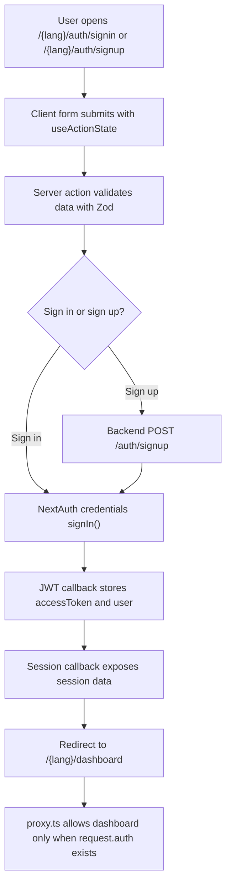

# Authentication

This project uses a credentials-based authentication flow built with NextAuth, server actions, and a locale-aware proxy route guard.

At a high level:

1. The UI exposes two forms: sign in and sign up.
2. Each form submits to a server action.
3. The sign-up action creates the user in the backend, then signs them in immediately.
4. The sign-in action validates input and signs the user in through NextAuth.
5. The proxy protects the dashboard and keeps authenticated users away from the auth pages.

## Routes

The auth feature lives under localized routes:

- `/[lang]/auth/signin`
- `/[lang]/auth/signup`
- `/[lang]/dashboard`

If a request does not include a supported locale, `proxy.ts` prepends one automatically before the app continues.

## UI

### Sign-in form

The sign-in UI is defined in [`components/signin-form.tsx`](./components/signin-form.tsx) and mounted by [`app/[lang]/auth/signin/page.tsx`](./app/[lang]/auth/signin/page.tsx).

Fields:

- Email
- Password

Behavior:

- The form is a client component.
- It uses `useActionState` to bind the server action and receive pending/error state.
- While the action is running, the submit button changes to `Signing in...`.
- If validation or authentication fails, the error is rendered in a red message box.

The page also includes:

- A link to the sign-up page
- A decorative image panel on desktop
- Social login buttons in the UI, but they are not wired to real providers yet

### Sign-up form

The sign-up UI is defined in [`components/signup-form.tsx`](./components/signup-form.tsx) and mounted by [`app/[lang]/auth/signup/page.tsx`](./app/[lang]/auth/signup/page.tsx).

Fields:

- Full name
- Email
- Password

Behavior:

- It also uses `useActionState` to talk to a server action.
- The submit button changes to `Creating account...` while pending.
- Validation and backend errors are shown inline.
- The page links back to the sign-in page.

## Server actions

The auth mutations live in [`app/actions/auth-actions.ts`](./app/actions/auth-actions.ts).

### Sign in

`signInAction` does three things:

1. Reads the submitted `FormData`
2. Validates it with `signInSchema`
3. Calls `signIn("credentials", ...)` from NextAuth

The action reads `lang` from a hidden input and redirects the user to `/{lang}/dashboard` after success.

### Sign up

`signUpAction` does more work:

1. Reads the submitted `FormData`
2. Validates it with `signUpSchema`
3. Sends the new user data to the backend NestJS API at `/auth/signup`
4. Signs the user in automatically with the same credentials
5. Redirects them to `/{lang}/dashboard`

This means a new user does not need to sign in manually after creating an account.

### Validation

Validation is defined in [`src/schemas/auth.ts`](./src/schemas/auth.ts):

- Sign in requires a valid email and a non-empty password
- Sign up requires:
  - a valid email
  - a password with at least 6 characters
  - a name with at least 2 characters

If validation fails, the server action returns the first validation error message and the form displays it.

## NextAuth setup

The NextAuth configuration is in [`auth.ts`](./auth.ts).

Important pieces:

- The project uses the `Credentials` provider.
- Credentials are posted to the backend through [`apiFetch`](./src/lib/api.ts).
- The backend sign-in endpoint is `/auth/signin`.
- If the backend returns both a user and an access token, the access token is stored on the NextAuth token and session objects.
- `pages.signIn` and `pages.newUser` point NextAuth to the localized auth pages.

### Token and session handling

The JWT callback stores:

- `accessToken`
- `user`

The session callback exposes the same values to the client session.

This is the part that makes the authenticated user state available throughout the app after login.

## Backend bridge

[`src/lib/api.ts`](./src/lib/api.ts) is a small fetch wrapper around the NestJS backend.

It:

- Uses `NEXT_PUBLIC_API_URL` when available
- Falls back to `http://localhost:5000`
- Forces JSON content type by default
- Throws a helpful error when the backend responds with a non-OK status

Both sign-in and sign-up rely on this helper, so the frontend never talks directly to the backend with raw fetch calls.

## Route protection

Real route protection happens in [`proxy.ts`](./proxy.ts).

### What the proxy does

The proxy runs before the app renders:

- If the URL does not contain a supported locale, it redirects to the same path with a locale prefix.
- If the request targets `/dashboard` and the user is not logged in, it redirects to `/{locale}/auth/signin`.
- If the request targets `/auth` and the user is already logged in, it redirects to `/{locale}/dashboard`.

The sign-in redirect also adds a `callbackUrl` query parameter so the app can preserve the original destination.

### Why this matters

This keeps the app consistent in three ways:

- Anonymous users cannot open the dashboard directly
- Logged-in users do not stay on auth pages
- Locale-prefixed routes stay stable across redirects

## Protected area

The dashboard shell is defined in [`app/[lang]/dashboard/layout.tsx`](./app/[lang]/dashboard/layout.tsx).

That layout wraps dashboard content with the app sidebar and page chrome, but it does not perform the actual access check itself. The access control is handled earlier by `proxy.ts`.

## Auth flow summary

## Notes

- The social buttons in the forms are visual only at the moment.
- The "Forgot your password?" link is present in the UI, but it is not wired up yet.
- `auth.ts` currently returns `authorized() { return true }`, so the proxy is the place that actually enforces page access.

